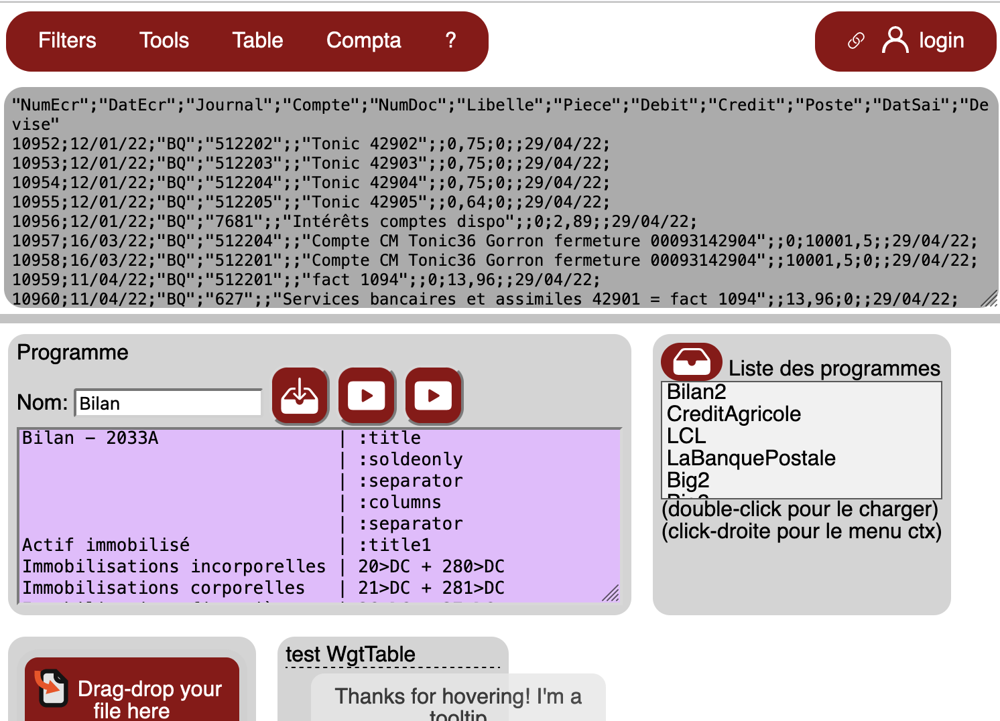

# txt-processor
When you download bank entries or accounting data, the text file you get may not meet your needs (charset, columns...). This tool can help you about that. 

<h1>Text processor for bank / accounting import - php & javascript</h1>

<h2>Description</h2>

When you download bank entries or accounting data, the text file you get may not meet your needs. 
This tool can help you about that.

Example of source texts :

<pre>
31/08/2022 -9,5  Virement    PRLV SEPA Coriolis Telecom              
01/09/2022 -72,0 Carte    CB  CHAUSSURES ARMEL 31/08/22        0 Divers 
06/09/2022 -2,0  Virement    PRLV SEPA PRIXTEL                       
06/09/2022 40,0        VIREMENT ADR - COURANT                  
13/09/2022 1350,0        VIREMENT M         
22/09/2022 -16,15  Carte    CB  TABAC PRESSE LES 21/09/22        0 Divers 
23/09/2022 -35,0 Chèque  8296         
26/09/2022 -172,0  Carte    CB  LE GULF STREAM   25/09/22        0 
</pre>

<pre>
Date;Libellé;Débit euros;Crédit euros;
04/11/2022;"VIREMENT EN VOTRE FAVEUR M. JACQUES LOYER    ";;1<0xa0>148,00;
03/11/2022;"COTISATION               CSCA PRIVILEGE     ";9,05;;
25/10/2022;"VIREMENT EN VOTRE FAVEUR CARPV ";;1<0xa0>002,22;
04/10/2022;"VIREMENT EN VOTRE FAVEUR M. JACQUES LOYER    ";;1<0xa0>148,00;
03/10/2022;"COTISATION               CSCA PRIVILEGE     ";9,05;;
</pre>

<pre>
Date  LibellÈ Montant(EUROS)
18/11/2022  "ACHAT CB   "  -32,00
18/11/2022  "ACHAT CB RELAY NUMERO                191  "  -2,70
17/11/2022  "VIREMENT INSTANTANE A M OU MME ALAIN remboursement  "  -105,00
16/11/2022  "ACHAT CB SENKICHI       15.11.22 CARTE NUMERO   "  -10,80
16/11/2022  "ACHAT CB CARREFOURCITYS 15.11.22 EUR          6,30 CARTE NO  296 APPLE PAY " -6,30
16/11/2022  "VIREMENT DE M REFERENCE : 01813190 "  2000,00
15/11/2022  "ACHAT CB E.LECLERC      14.11.22 EUR         97,74 CARTE NO  296  "  -97,74
</pre>

Note :
It is made for french numbers / dates
- 1000000,00  (decimal is comma, not point)
- 31/12/2022  (dd/mm/yyyy) or (dd/mm/yy) 

<h2>Snapshot</h2>

<h2>Installation</h2>

In a php webserver, put these files :
-- index.php
-- favicon.svg
-- src (directory)
    -- all other files
-- icons (directory)
    -- all other files
    -- framework7-icons.css
    -- framework7-icons (directory)
-- rw (directory)
    -- all other files
-- src (directory)
    -- all other files

